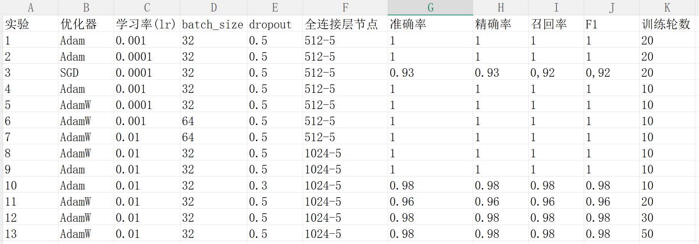

# pytorch
深度学习初学者首个demo

## 基于 ResNet18 的宝可梦图像分类与调参实验

# 根据实验结果可知，
1.10轮的训练就足够了，训练轮数的增加不会带来明显的效果；
2.Adam优化器+0.001的学习率是较稳定的组合；
3.在0.0001的学习率的条件下，SGD优化器仍然达不到100%的准确率，因此说明SGD优化器不适合本次实验；
4.增加模型容量（1024节点）无意义。

# 最佳参数组合：
优化器：Adam + 学习率：0.001 + batch_size:32 + dropout:0.5 + 
全连接层：512—>5 + 训练轮数：10